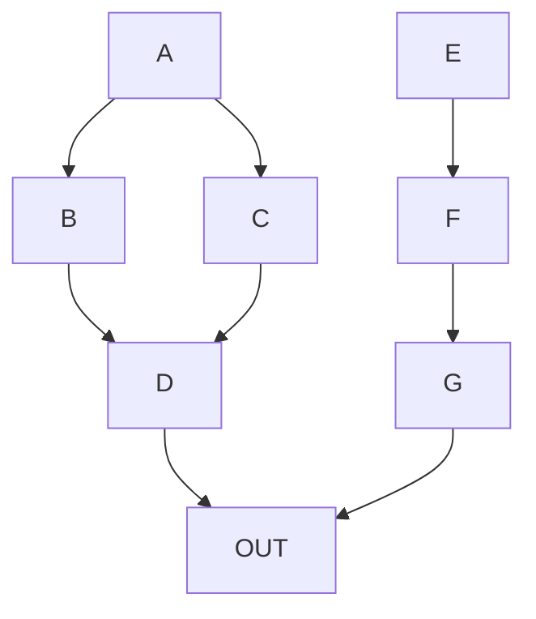

Mermaid diagrams provide a way to display graphs defined as plain text.
Some markdown renderers support this as a plugin.  GitHub now supports
it.

## example

You can define nodes like this in mermaid, and GitHub will now render
them as a pretty graph diagram.  Its rendered in svg, so its searchable
with `control f` and everything.

## Links

* [GitHub support announcement](https://github.blog/2022-02-14-include-diagrams-markdown-files-mermaid/)
* [mermaid docs](https://mermaid-js.github.io/mermaid/#/)